# I - Environnement de développement
## 01. Environnement virtuel (pipenv, etc.)
## 02. IDE or Text Editor ? (VSC, Vim, Notepad++, outils Jetbrains, etc.)
## 03. Cloud plateform: Jupyter, Collab, etc.
## 04. Package manager : anaconda (data science), npm (node), pip (python), etc.
## 05. Raccourcis de productivité

# II - Les types de données
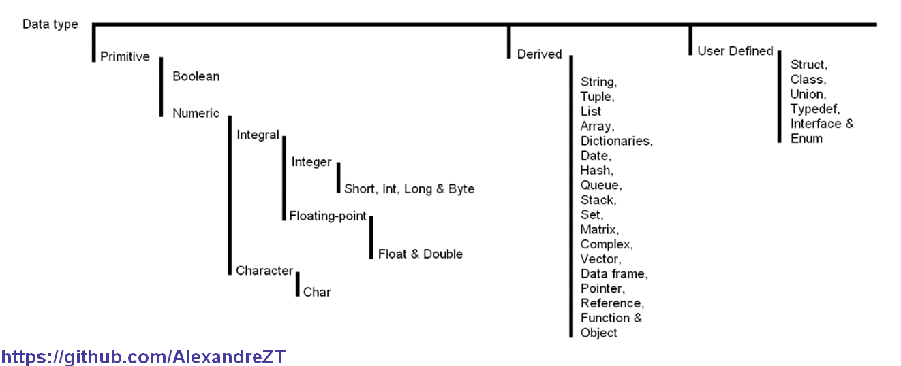
## 01. La table ASCII
## 02. Les caractères d'échappement
## 03. Les opérateurs arithmétiques :
### 03.A. Addition / incrémentation / concaténation
### 03.B. Soustraction (Substration) / décrémantion / déconcaténation
### 03.C. Multiplication
### 03.D. Puissance (Exponentiation)
### 03.E. Division
### 03.F. Division entière (Floor division)
### 03.G. Modulo (modulus)

# III - Structures conditionnelles
##  01. La comparaison
### 01.A. supérieur à
### 01.B. inférieur à
### 01.C. égal à
### 01.D. différent de
### 01.E. supérieur ou égal à
### 01.F. inférieur ou égal à
## 02. Les opérateurs AND, OR, NOT
## 03. Les boucles : while / do…while (repeat… until) & for.
## 04. Les conditions : if…else & switch.
## 05. Contrôle de boucles : repeat, break, next, continue, pass & txtProgressBar.

# IV - Les principaux paradigmes de programmation

# V - Fonctions, procédures et arguments

# VI - Built-in functions

# VII - Les librairies principales

# VIII - Spécificité et bonnes pratiques du langage
##	01. Point forts et faiblesses
##	02. Les commentaires 
### 02.A. Single Line Comment
### 02.B. Multi Line Comment
### 02.C. Documentation Comment
## 03. Convention de nommage (classe, méthode, fonctions, constante, variable, module, package, etc.)
### 03.A. Pascal Case : FirstName
### 03.B. Camel Case : firstName
### 03.C. Screaming Case : FIRSTNAME
### 03.D. Snake Case : first_name
### 03.E. Kebab case : first-name
### 03.F. Hungarian Notation : strFirstName

## IX - Les langages interprétés vs compilés + Input/Output
## 01. La compilation
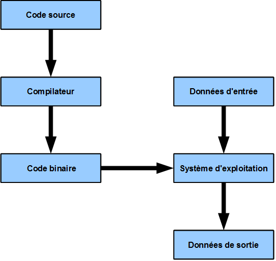
## 02. L'interprétation

# X - OOPs (Object-Oriented Programming System)
## 01. Class, factory and objects

### 02. Inheritance

## 03. Polymorphism

## 04. Abstraction 

## 05. Encapsulation (public, private & protected)

## 06. Coupling vs Cohesion
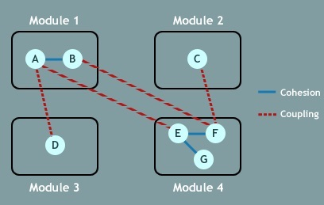
## 07. Association

## 08. Aggregation (uses)

## 09. Composition (owns)
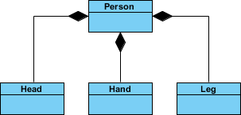
## 10. Generalization and specialization

# XI - Développement web
## 01. La standardisation W3C, ECMAScript, RFC, etc.
## 02. CMS (Content Management System) : 
### 02.A. #1 WordPress
### 02.B. #2 Drupal
### 02.C. #3 Shopify
## 03. Le marketing digital

## 04.	Front-end technologies :

## 04.A. Qu’est-ce que le DOM (Document Object Model)

## 04.B. L’essentiel des tags HTML et des styles CSS
## 04.C. JavaScript :
### 04.C.a. Dynamisation des pages
### 04.C.b. Manipulation du DOM avec la librairie jQuery
### 04.C.c. Les fonctions à flèches depuis l’ES6.
### 04.C.d. L’asynchronisme avec les promesses (promise, resolve, reject)
## 04.D. Framework JS : 
### 04.D.a. #1 React
### 04.D.b. #2 Angular
### 04.D.c. #3 Vue.js
## 04.E. Framework CSS : #1 Bootstrap, #2 Semantic UI
## 04.F.	Créer une maquette (tous les écrans d’une app) et les coder
### 04.F.a. #1 Adobe XD (Windows et Mac)
### 04.F.b. #2 Sketch (Mac) 
## 04.G. SPA (Single Page Application) vs MPA (Multi Page Application)

## 05. Back-end technologies :  

### 05.A. Server framework :
#### 05.A.a. Node : #1 Express.js (Jest, Mocha, Jasmine, Karma, selenium, etc)
#### 05.A.b. Python : #1 Django et #2 Flask (unittest, selenium, etc)
#### 05.A.c. PHP #1 Laravel et #2 Symfony (testunit, etc)
#### 05.A.d. Java : #1 Spring (JUnit, selenium, etc)
#### 05.A.e. C# : #1 ASP.NET (MSTest, selenium, etc)
### 05.B. Les architecture web : MVC vs MVT (django)

### 05.C. Web services (deux grandes familles) :

#### 05.C.a. Simple Object Access Protocol
#### 05.C.b. Extensible Markup Language
#### 05.C.c. REpresentational State Transfer
#### 05.C.d. JavaScript Object Notation
#### 05.C.e. Communication client/serveur 
### 05.D. La méthode AJAX (Asynchronous JavaScript And XML)

### 05.E. Les protocoles internet :

### 05.F. HTTP request

### 05.G. HTTP methods

### 05.H. HTTP status code

### 05.I. HTTPS

### 05.J. HTTP/1 vs HTTP/2
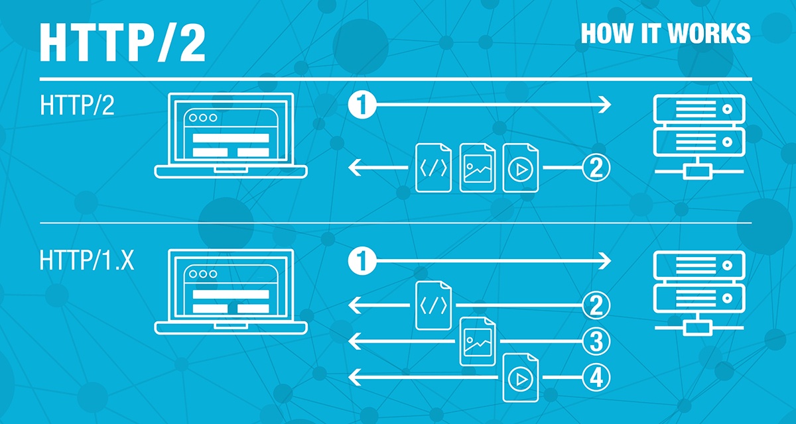
### 05.K. Le modèle OSI et le modèle TCP/IP
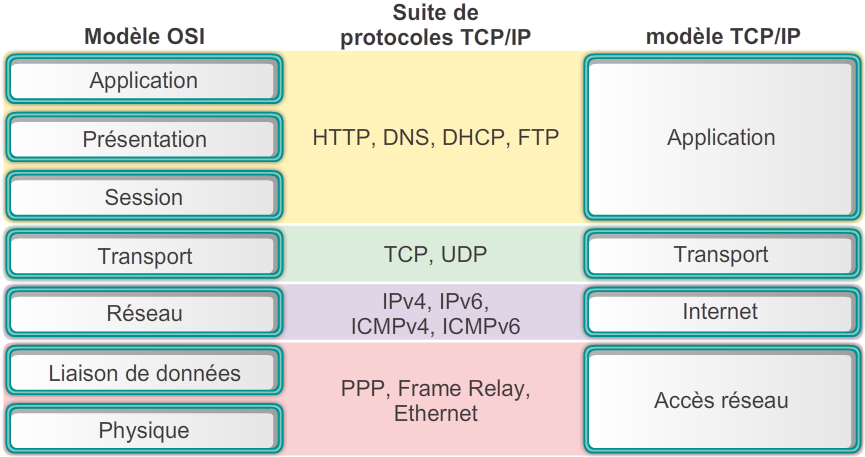
### 05.L.  Duplex (canal de communication)
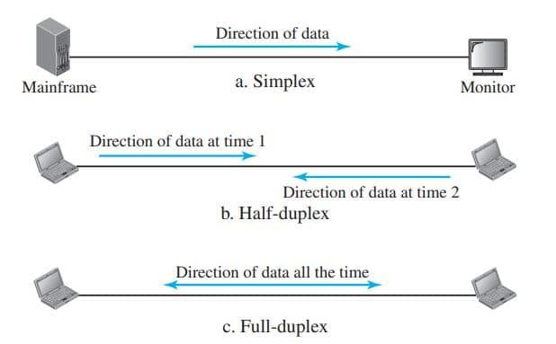
#### 05.L.a. Les Websockets sont une spécification full-duplex du protocole HTTP.
##### 05.L.a. - Utilisé pour le développement de messagerie instantanée.

# XII - Base de données 
## 01. RDBMS / SGBDR :

### 01.A. Propriétaire : #1 Oracle, #2 Microsoft Server #3 MySQL
### 01.B. Libre : #1 PostegreSQL #2 MariaDB, #3 SQLite
## 02. OLTP (Online Transactional Processing) / OLAP (Online analytical processing)

## 03. SQL
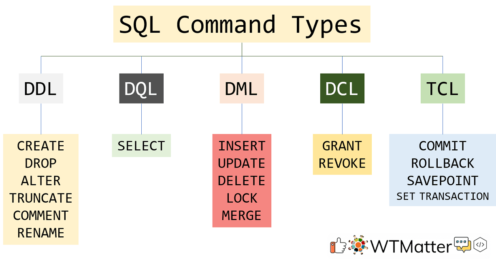
### 03.A. Les jointures
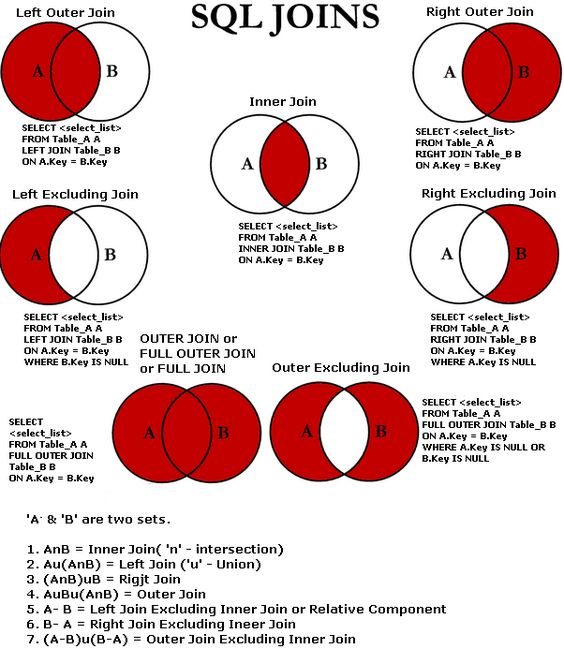
## 04. NoSQL databases :

## 05. Cloud providers :
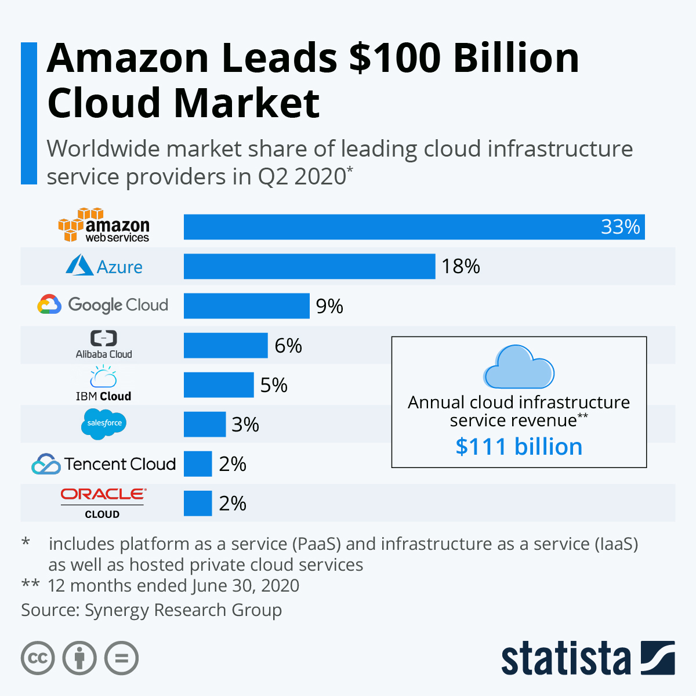
## 06. ORM (Object-Relational Mapping)

# XIII - La mémoire : 
## 01. Allocation statique vs dynamique
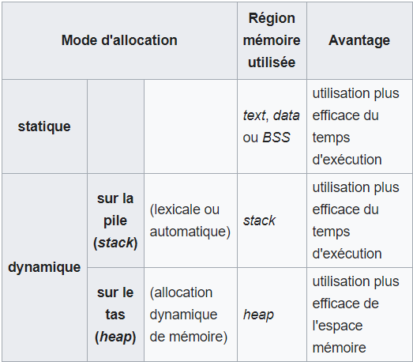
## 02. Stockage de la mémoire
### 02.A. Queue allocation (la file)

### 02.B. Stack allocation (la pile)

### 02.C. Heap allocation (le tas)
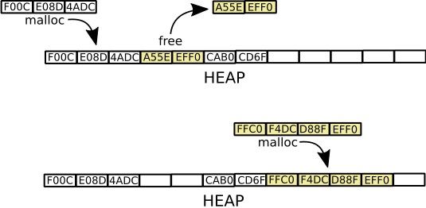
## 03. Les pointeurs

# XIV - File management (read, write, append, create, etc.)
## 01. Les types de fichiers (TXT, CSV, JSON, PDF, etc.)

# XV - Les algorithmes (voir : project euler)
## 01. Performances
### 01.A. Time complexity : mesure de la complexité d'un calcul en fonction de son nombre d'étapes, autrement dit son temps d'exécution.
### 01.B. Big O notation : il s'agit d'une notation décrivant la complexité d'un temps de calcul.

## 02. Les algorithmes pricipaux
### 02.A. Sort Algorithms (Merge Sort, Quick Sort, Bucket Sort, Heap Sort, Counting Sort)
### 02.B. Search Algorithms (Binary search, Depth/Breadth First Search)
### 02.C. Hashing
### 02.D. Dynamic Programming
### 02.E. Exponentiation by squaring
### 02.F. String Matching and Parsing (KMP Algorithm, Regular Expression)
### 02.G. Primality Testing Algorithms

# XVI - Testing
## 01. Pyramid : 
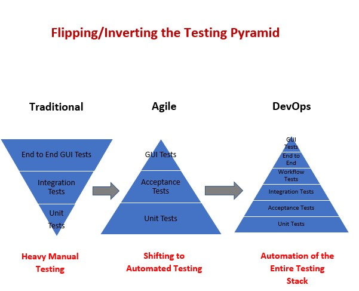
## 02. Autres :
### 02.A. Test fonctionnels et non fonctionnels
### 02.B. Smoke test and sanity check
### 02.C. Proof of Concept (PoC)
## 03. Exception Handling :
### 03.A. try… raise/catch/except…finally/except
### 03.B. throws…throw

# XVII - Les designs patterns (outil apporte des solutions aux problèmes communs de développement logiciel en rendant le code flexible, réutilisable et maintenable)
## 01. Il existe 3 grand type de design pattern
### 01.A. Creational « factory » : création
### 01.B. Behavioral: comportemental
### 01.C. Structural : structurante

# XVIII - Documentation logicielle
## 01. L'expression de besoin 
### 01.A. Définit le besoin du métier lors d'une demande.
## 02. Architecture / Conception : diagrammes UML)
### 02.A. Vue d'ensemble sur le logiciel. Elle inclut les relations à l'environnement et les principes à utiliser dans la conception et la réalisation des composants logiciels.
## 03. Technique
### 03.A. Documentation du code, algorithmes, interfaces, et interfaces de programmation (API).
## 04. Utilisateur
### 04.A. Manuels pour les utilisateurs, administrateurs systèmes et personnel de support.
## 05. Marketing
### 05.A. Instructions sur le produit et garantie promotionnelle.

# XIX. L’architecture des ordinateurs (Taxonomie de Flynn)
## 01. Single Instruction on Single Data

## 02. Multiple Instructions on Single Data

## 03. Single Instruction on Multiple Data
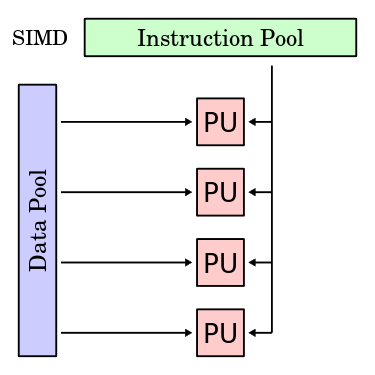
## 04. Multiple Instructions on Multiple Data 

# XX. Single-Thread vs Multi-Thread programming

# XXI. Synchronous vs Asynchronous programming 

# XXII 21. DevOps
## 01. Git & Git CLI (#1 GitHub, #2 Gitlab, #3 Bitbucket, #4 Gitbucket)
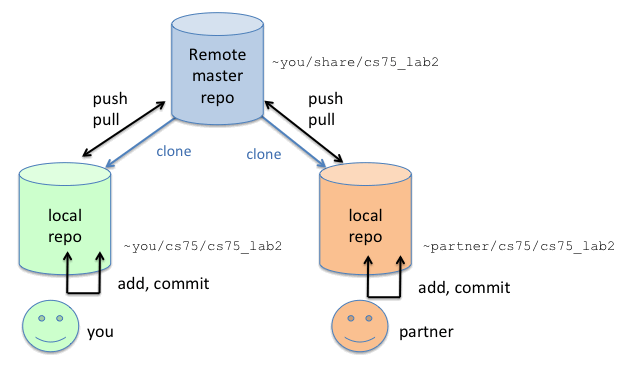
## 02.  Semantic versioning

## 03. Linux
### 03.A. Redhat
### 03.B. Ubuntu

### 03.C. Les scripts bash

## 04. Protocole SSH (Secure SHell)
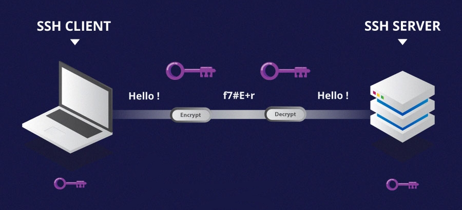
## 05. Les containers

## 06. CI / CD : Continuous Integrations / Countinuous Deployment
## 07. Les tests automatisé : Selenium
## 08. Logiciels de virtualisation : VirtualBox, VMWare
## 09. Autres outils devops :
### 09.A. Ansible
### 09.B. Jenkins
### 09.C. Vagrant : environnements de développement virtuel
### 09.D.Splunk

# XXIII. Data Science

## 01. Types de données :
### 01.A. Numérique :
#### 01.A.a. discrète : prendre une seule valeur entière
#### 01.A.b. continue : peut prendre une infinité de valeur
### 01.B. Catégorique :  Ne peut-être mesuré, comme une couleur, un booléen, etc.
### 01.C. Ordinal : Simillaire aux données catégorique, à la différence qu'on peut distinguer les valeurs prises, comme la note A est meilleur qu'une note B.
## 02. Mathématiques
### 02.A. Linear algebra (algèbre linéaire)
#### 02.A.a. Matrix (matrice)
## 03. Statistiques
### 03.A. Mean (moyenne) : Résume une série de valeur en un seul nombre réel. Il s'agit de la somme des valeurs d'une série divisé par son nombre d'élément.
### 03.B. Median (Médiane) : Permet de partager une série de valeur en deux parties de même nombre d'élément. Il s'agit de la valeur du milieu d'une sérieu rangé par ordre croissant.
### 03.C. Mode (mode) : Permet de connaître la (ou les) valeur(s) la (ou les) plus fréquante(s) dans une série. Il s'agit d'une valeur ayant le plus de récurrence dans une série.
### 03.D. Variance (variance) : Mesure de la dispertion des valeurs d'unéchantillon ou d'une distribution de probabilité (sans tenir compte des signes).
### 03.E. Standard deviation (écart-type) :  Mesure de la dispertion des valeurs à partir de la moyenne.
### 03.F. Confidence Interval (Intervalle de confiance) : Défini une marge d'erreur dans un résultat. Le dégré de confiance est souvent défini à 95%, ce qui signifi qu'en moyenne, 95% des résultats seront correct.
### 03.G. Expected value (espérance) : Représente la valeur que l'on s'attend à trouver, en moyenne, si 'lon répète un grand nombre de fois la même expérience aléatoire. Il s'agit d'une moyenne pondérée par les probabilités d'apparition de chaque valeur.
### 03.H. Percentile (percentile) : Décrit la valeur à laquelle un pourcentage donné des valeurs est inférieur.
### 03.I. Quantiles : divisent un jeu de données en intervalles contenant le même nombre de données.
### 03.J. RMSE (ROOT MEAN SQUARE ERROR)
### 03.K. R-squared : mesure la qualité de la prédiction d'une régression linéaire, ainsi la qualité du model utilisé.
### 03.L. L'échatillonnage : On essaye de représenter une population à partir d'un sous ensemble. Les types d'échantillons sont : aléatoire, arbitraire, par itinéraire et par quotas.
### 03.M. p-value : est la probabilité pour un modèle statistique donné sous l'hypothèse nulle d'obtenir la même valeur ou une valeur encore plus extrême que celle observée.
## 04. Probabilité
### 04.A. Normal distribution / Gaussiandistribution (loi normal ou loi de Gauss) : La loi normale (ou loi de Gauss) permet de modéliser des phénomènes naturels issus de plusieurs évènements aléatoires.
### 04.B. Continuous uniform distribution / rectangular distribution (loi uniforme continue ou loi rectangulaire) : La loi uniforme continue (ou loi rectangulaire) a pour propriétéque la densité de probabilités deceslois est constante sur leur support.
### 04.C. Discrete uniform distribution (loi uniforme discrète) : La loi uniforme discrète est uneloi indiquantune probabilité de se réaliser identiqueà chaque valeur d'un ensemble fini de valeurs possibles.
### 04.D. Binomial distribution (loi binomiale) : La loi binomiale modélise la fréquence du nombre de succès obtenus lors de la répétition de plusieurs expériences aléatoires identiques et indépendantes.
### 04.E. Poisson distribution (loi de poisson) : La loi de poisson est une loi qui décrit le comportement du nombre d'évènement se produisant dans un intervalle de temps fixé.
## 05. Big Data
## 06. Intelligence artificielle
### 06.A. Les réseaux neuronaux

#### 06.A.a. Weight : importance de l'influence de l'input sur l'output
#### 06.A.b. Biais : constante d'ajustement
#### 06.A.c. Softmax activation
## 07. La blockchain
## 08. Time series
## 09. Machine learning :
### 09.A. Augmenter la précision du modèle :
#### 09.A.a. Ajouter des données
#### 09.A.b. Traiter les valeurs manquantes ou aberrantes
#### 09.A.c. Transformer et créer des variables
#### 09.A.d. S'appuyez sur les connaissances du domaine, la viz, la p-value ou le PCA (principal component analysis)
#### 09.A.e. Utiliser un autre algorithme (trouver le meilleur)
#### 09.A.f. Trouver les paramètres idéaux
#### 09.A.g. Combiner les résultats de différents modèle : bagging & boosting
#### 09.A.h. Le Surentrainement rend une modèle inprécis
#### 09.A.i. La cross-validation : laisser un échantillion sans entrainement pour le tester plus tard après l'entrainement
### 09.B. Classification VS Régression
### 09.C. Apprentissage : supervisé, non/semi-supervisé, par renforcement et incrémental
### 09.D. Algorithmes (k-moyennes / proches voisins, etc.)
## 10. Python libraries
### 10.A. Machine Learning : scikit-learn, keras, orange
### 10.B. Web Scraping : beautifulsoup, selenium, scrapy
### 10.C. Deep Learning : tensorflow, pytorch
### 10.D. Data Visualization : matplotlib, seaborn
### 10.E. Data Analysis : pandas, numpy, scipy
### 10.F. Image Processing : pillow, opencv
### 10.G. Audio processing : Librosa
### 10.H. Natural Language processing : NLP, NLTK
### 10.I. Statistique : statsmodels
## 11. JavaScript libraries
### 11.A. Web Scraping : puppeteer.js
### 11.B. Data Visualization : D3.js, DC.js
### 11.C. Machine learning : ml.js
## 12. R package
### 12.A. Data Visualization : ggplot2, plotly, esquisse
### 12.B. Machine Learning : mlr3
### 12.C. Data analysis : dplyr
### 12.D. Web Scraping : RCrawler
### 12.E. Mics : Tedyverse, bioconductor, shiny
## 13. Hadoop
## 14. Apache Spark
## 15. Tools : Tableau, PowerBI, Qlickview, Excel, etc.

# XXIV - Mobile development
## 01. Android
### 01.A. Plateforme : Android Studio
### 01.B. Langage : Java, Kotlin
## 02. iOS
### 02.A. Plateforme: Xcode
### 02.B. Language : Swift, ~~Objective-C~~
## 03. Cross-plateform
### 03.A. Flutter & Dart
### 03.B. JavaScript & React Native
### 03.C. Xamarin & C#
### 03.D. HTML5 & Apache Cordova

# XXV - ERP VS CRM

# XXVI - Législation
## 01. Propriété intellectuel et droit internet
## 02. Le RGPD (Règlement Général sur la Protection des Données) ou GDPR (General Data Protection Regulation
## 03. Hadopi (Haute Autorité pour la Diffusion des Œuvres et la Protection des droits sur Internet)
## 04. La CNIL (Commission Nationale de l'Informatique et des Libertés)
## 05. Les licences logiciels
### 05.A. Les quatre libertés fondamentales du logiciel libre :
#### 05.A.a. La liberté d'utiliser le logiciel ;
#### 05.A.b. La liberté d'étudier le logiciel ;
#### 05.A.c. La liberté de copier le logiciel ;
#### 05.A.d. La liberté de modifier le logiciel et de redistribuer les versions modifiées.

### 05.B. Logiciel propriétaire : 
#### 05.B.a. Par opposition au logiciel libre, un logiciel propriétaire ne garantit pas l'ensemble des quatre libertés du logiciel libre.

### 05.C Open-source : 
#### 05.C.a. Libre redistribution, d'accès au code source et de création de travaux dérivés
#### 05.C.b. Le code source est mis à la disposition du grand public, ce code source est généralement le résultat d'une collaboration entre programmeurs. 

### 05.D. Free Software Foundation :
#### 05.D.a. Organisation à but non lucratif dont la mission est la promotion du logiciel libre et la défense des utilisateurs.

### 05.E. Licence de logiciel permissive : 
#### 05.E.a. Licence publique générale GNU (GNU General Public License)
#### 05.E.b. Licence MIT : Licence de logiciel pour logiciels libres et open source, provenant de l'Institut de technologie du Massachusetts (MIT).
#### 05.E.c. Licence Apache : Licence de logiciel libre et open source. Elle est écrite par l'Apache Software Foundation. 
#### 05.E.d. Licence BSD (Berkeley Software Distribution License) : Elle permet de réutiliser tout ou une partie du logiciel sans restriction, qu'il soit intégré dans un logiciel libre ou propriétaire.

# XXVII - Sécurité informatique / technique de piratage
## 01. Surface web vs Deep web vs Dark web

### 01.A. Tails / Tor / .onion
## 02. VPN
## 03. firewall
## 04. windows defender
## 05. antivirus
## 06. metasploit
## 07. Le chiffrement (ou cryptage) vs le encrypter (ou encryption)  / 
## 08. Crypter / Cryptage vs Encrypter / Déencrypter
## 09. Chiffrer / Déchiffrer
## 10. Les algorithmes de hashage

## 11. Permutations and combination formulae
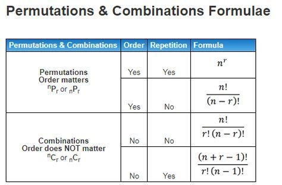
## 12. Les logiciels malveillants ou malwares : Les chevaux de Troie, les ransomwares, etc.
## 13. Les sniffer (analyseur réseau) : Permet d'écouter le trafic d'un réseau afin de capturer les informations qui y circulent.
## 14. Bruteforce / attaque par dictionnaire : Cherche à cracker un mot de passe, en testant toutes les combinaisons possible
## 15. Injection SQL
## 16. Man in the middle
## 17. Backdoor
## 18. DDoS attack (Distributed Denial-of-Service attack)
## 19. Phishing

## XXVIII - Management
## 01. Méthodologie
### 01.A. Agil
#### 01.A.a. Les 12 principes fondamentaux

#### 01.A.b. Frameworks

### 01.B. ITIL
## 02. Outils
### 02.A. GANTT
## 03. Lois de productivité :
### 03.A. Loi de Pareto (ou loi 80/20)
### 03.B. Loi d'Illich
### 03.C. Loi de Laborit
### 03.D. Loi de Parkinson
### 03.E. Loi de Carson
### 03.F. Loi de Fraisse
### 03.G. Loi de Hofstadter
### 03.H. Loi de Murphy
### 03.I. Loi de Swoboda-Fliess-Teltscher
## 04. La matrice d'Eisenhower
