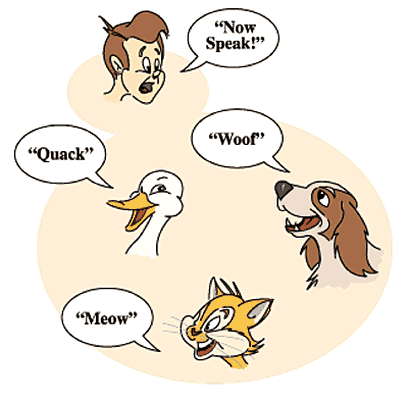

# DevUniverse
## Environnement de développement
###	Environnement virtuel (pipenv, etc.)
### IDE or Text Editor ?(VSC, Vim, Notepad++, outils Jetbrains, etc.)
### Cloud plateform: Jupyter, Collab, etc.
### Package manager : anaconda (data science), npm (node), pip (python), etc.
## Les types de données

## Structures conditionnelles
###	Les boucles : while / do…while (repeat… until) & for.

###	Les conditions : if…else & switch.

###	Contrôle de boucles : repeat, break, next, continue, pass & txtProgressBar.

##	Les principaux paradigmes de programmation

##	Fonctions, procédures et arguments

##	Built-in functions

##	Les librairies principales

##	Spécificité et bonnes pratiques du langage
###	Point forts et faiblesses

###	Les commentaires 
#### Single Line Comment

#### Multi Line Comment
#### Documentation Comment

###	Convention de nommage (classe, méthode, fonctions, constante, variable, module, package, etc.)
#### Pascal Case : FirstName
#### Camel Case : firstName
#### Screaming Case : FIRSTNAME
#### Snake Case : first_name
#### Kebab case : first-name
#### Hungarian Notation : strFirstName

## Les langages interprétés vs compilés + Input/Output
###	La compilation

### L'interprétation

## OOPs (Object-Oriented Programming System)

### Classes, Object

### Inheritance

### Polymorphism

### Abstraction 

### Encapsulation (public, private & protected)

