# I - Environnement de développement
## 01. IDE or Text Editor ? (VSC, Vim, emacs, nano, Notepad++, outils Jetbrains, repl.it, etc.)
## 02. Environnement virtuel (virtualenv (python), RVM (ruby), etc.)
## 03. Notebook interface: Jupyter, Colaboratory, etc.
## 04. Package manager : conda (anaconda), npm (node), pip (python), etc.
## 05. Raccourcis de productivité

# II - Les types de données

## 01. La table ASCII

## 02. Les caractères d'échappement
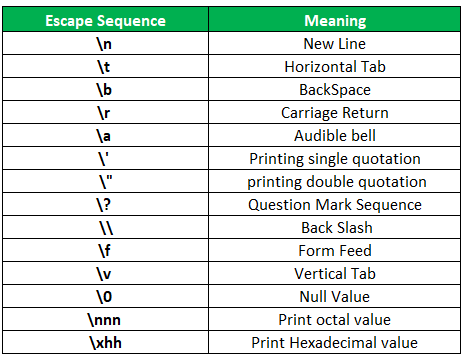
## 03. Les opérateurs arithmétiques :
|Opérateur|Signification|Meaning|
|---------|-------------|-------|
|a+b|Addition|Addition|
|a-b|Soustraction|Substraction|
|a.b|Multiplication|Multiplication|
|a^b|Puissance|Exponentiation|
|a/b|Division|Division|
|⌊a/b⌋|Division entière|Floor Division|
|a%b|Modulo|Modulus|

# III - Structures conditionnelles
##  01. Les opérateurs relationnels (outils de comparaison)
|Opérateur|Signification|
|-------|-------------|
|>|supérieur à|
|<|inférieur à|
|≤|supérieur ou égal à|
|≤|inférieur ou égal à|
|=|égal à|
|≠|différent de|

## 02. Les opérateurs logiques
|Opérateur|Signification|
|---------|-------------|
|NOT|L'opérateur "NOT" (NON en français) permet d'évaluer une expression à vrai si le test est faux|
|AND|L'opérateur "AND" (ET en français) permet d'évaluer une expression à vrai si chacun des tests sont vrais|
|OR|L'opérateur "OR" (OU Inclusif en français) permet d'évaluter une expression à vrai si au moins un test est vrai|
|XOR|L'opérateur "XOR" (OU eXclusif en français) permet d'évaluer une expression à vrai si seulement un test est vrai|

## 03. Les boucles : while / do…while (repeat… until) & for.
## 04. Les conditions : if…else & switch.
## 05. Contrôle de boucles : repeat, break, next, continue, pass & txtProgressBar.

# IV - Les principaux paradigmes de programmation
|Paradigm|Description|
|--------|-----------|
|Machine Code|Represents the instructions (the contents of program memory) as a sequence of numbers, and assembly language where the machine instructions are represented by mnemonics and memory addresses can be given symbolic labels|
|Imperative|Programs as statements that directly change computed state|
|Sturtured|A style of imperative programming with more logical program structure|
|Procedural|Derived from structured programming, based on the concept of modular programming|
|Functional|Treats computation as the evaluation of mathematical functions avoiding state and mutable data|
|Event-driven|Control flow is determined mainly by events, such as mouse clicks or interrupts including timer|
|Object-oriented|Treats datafields as objects manipulated through predefined methods only|
|Declarative|Defines program logic, but not detailed control flow|
|Automata-based progrmaming|Treats programs as a model of a finite state machine or any other formal automata|

## L'évolution des paradigmes de programmations rendent d'avantage le code : modulaire, réutilisable et évolutif

# V - Fonctions, procédures et arguments

# VI - Built-in functions

# VII - Les librairies principales

# VIII - Spécificité et bonnes pratiques du langage
##	01. Point forts et faiblesses
##	02. Les commentaires 
### 02.A. Single Line Comment
### 02.B. Multi Line Comment
### 02.C. Documentation Comment
## 03. Convention de nommage (classe, méthode, fonctions, constante, variable, module, package, etc.)
|Convention Name|Example|
|---------------|-------|
|Pascal Case|FirstName|
|Camel Case|firstName|
|Screaming Case|FIRSTNAME|
|Snake Case|first_name|
|Kebab case|first-name|
|Hungarian Notation|strFirstName|

# IX - Les langages interprétés vs compilés + Input/Output
## 01. La compilation

## 02. L'interprétation

# X - OOPs (Object-Oriented Programming System)
## 01. Class, factory and objects
### Avec une classe abstraite, on ne peux pas créer d'objet.
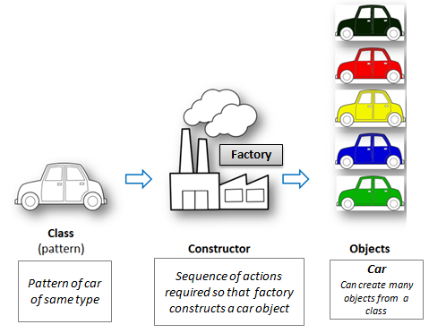
### 02. Inheritance

## 03. Polymorphism

## 04. Abstraction 

## 05. Encapsulation (public, private & protected)
### Publique : Accessible partout.
### Protégé : Accessible uniquement au sein de la classe elle-même et par les classes filles et parent.
### Privé : Accessible uniquement par le groupe qui définit le membre.

## 06. Coupling vs Cohesion

## 07. Association

## 08. Aggregation (uses)
### L'objet esclave est indépendant et ne sera pas supprimé si l'objet maître est supprimé.

## 09. Composition (owns)
### L'objet esclave est supprimé si l'objet maître est supprimé.

## 10. Generalization and specialization

# XI - Développement web
## 01. La standardisation W3C, ECMAScript, RFC, etc.
## 02. CMS (Content Management System) : 
|Popularity|Name|
|----------|----|
|#1|WordPress|
|#2|Drupal|
|#3|Shopify|
## 03. Le marketing digital
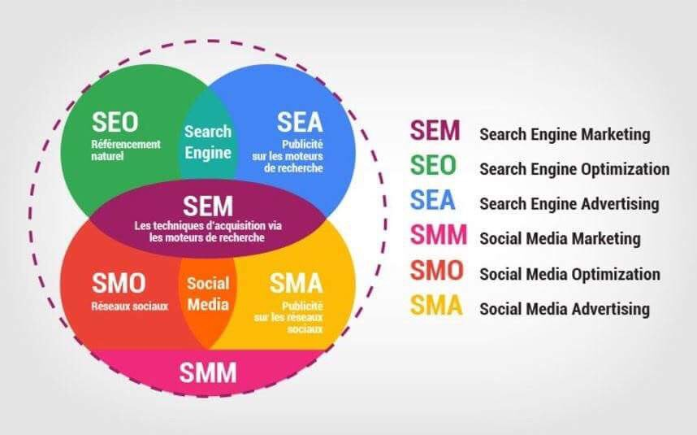
## 04.	Front-end technologies :

## 04.A. Qu’est-ce que le DOM (Document Object Model)
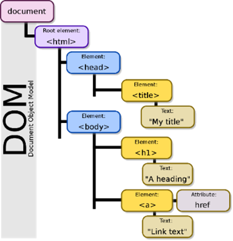
## 04.B. HTML
### 04.B.a. Les balises fondamentales HTML :
|Tag name|Definition|
|--------|----------|
|html|root container|
|head|metadata container|
|title|Title|
|meta|metadata|
|link|link to external style sheet|
|body|document container|
|h1-h6|Heading|
|img|Image|
|p|Paragraph|
|span|Text container|
|div|Division|
|ul|Unordered List|
|ol|Ordered List|
|li|List Item|
|table|Table container|
|tr|table row|
|th|table header|
|nav|Navigation container|
|article|Article container|
|header|Header container|
|footer|Footer container|
|em|Emphasis text|
|b|Bold text|
|strong|Strong text|
|i|italic text|
|small|Small text|
|u|underline|
|strike|Deleted text|
|a|anchor|
|hr|Horizontal Rule|
|script|execute or link to external script|
### 04.B.b. Les attributs HTML
## 04.C. CSS
### 04.C.a. Les sélecteur CSS : 
|Selector|Syntax|Description|
|--------|------|-----------|
|element selector|element {}|Sélection d'un type d'élément|
|multiple element selector|element1, element2 {}|Sélection de plusieurs élements|
|star selector|* {}|Sélection de tous les éléments|
|id selectors|#idName {}|Sélection sur un id unique|
|class selectors|.className {}|Sélection sur une classe|
|attribute selector|element[attribute=value] {}|Sélection à partir de son attribut|
|Descendant selector|element1 element2 {}|Sélection des éléments contenu dans l'élément ancestre|
|Child selector|element1>element2 {}|Sélection des éléments d'un élément parent|
|Adjacent sibling selector|element1+element2 {}|Sélection de l'élément qui est précédé d'un autre élément|
|General sibling selectors|element1~element2 {}|Sélection de tous les élément précédé d'un autre élément|
|Pseudo-classes|selector:pseudo-class {}|Sélection à partir de l'état de l'élément|
|Pseudo-element|selector::pseudo-element {}|Sélection d'un fragment d'un élément|
|nth-of-type|element:nth-of-type(n) {}|Sélection des éléments d'un type donné, en fonction de leur position au sein d'un groupe de frères et sœurs|
|nth-child|element:nth-child(n) {}|Sélection des éléments basés sur leur position dans un groupe de frères et sœurs|
### 04.C.b. Les propriétés CSS
|Propriété CSS|
|-------------|
|marging|
|padding|
|border|
|font|
|color|
|background|
|display|
|width|
|height|
|float|
|...|
### 04.C.c. Les préprocesseur CSS
|Préprocesseur CSS|
|-----------------|
|SASS (Syntactically Awesome Style Sheet)|
|LESS (Leaner Style Sheets)|
|Stylus|
### 04.Cd Framework CSS : 
|Popularity|Name|
|----------|----|
|#1|Bootstrap|
|#2|Semantic UI|
## 04.D. JavaScript :
### 04.D.a. Dynamisation des pages
### 04.D.b. Manipulation du DOM avec la librairie jQuery
### 04.D.c. Les fonctions à flèches depuis l’ES6.
### 04.D.d. L’asynchronisme avec les promesses (promise, resolve, reject)
### 04.D.e. Framework JS : 
|Popularity|Name|
|----------|----|
|#1|React|
|#2|Angular|
|#3|Vue|
## 04.E.	Créer une maquette (tous les écrans d’une app) et les coder
|Popularity|Name|
|----------|----|
|#1|Adobe XD (Windows et Mac)|
|#2|Sketch (Mac) |
## 04.F. SPA (Single Page Application) vs MPA (Multi Page Application)

## 05. Back-end technologies :  
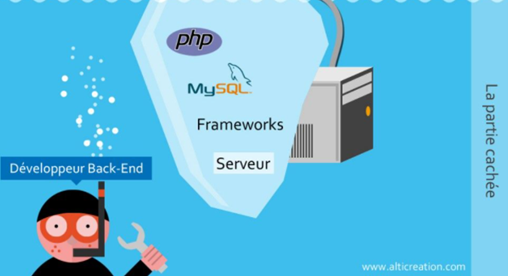
### 05.A. Server framework :
#### 05.A.a. Node : (Jest, Mocha, Jasmine, Karma, selenium, etc)
|Popularity|Name|
|----------|----|
|#1|Express|
|#2|Meteor|
#### 05.A.b. Python : (unittest, selenium, etc)
|Popularity|Name|
|----------|----|
|#1|Django|
|#2|Flask|
#### 05.A.c. PHP : (testunit, etc)
|Popularity|Name|
|----------|----|
|#1|Laravel|
|#2|Symfony|
#### 05.A.d. Java : (JUnit, selenium, etc)
|Popularity|Name|
|----------|----|
|#1|Spring|
#### 05.A.e. C# : (MSTest, selenium, etc)
|Popularity|Name|
|----------|----|
|#1|ASP.NET|
### 05.B. Les architecture web : 
#### 05.B.a MVC 

#### 05.B.b MVT (django)
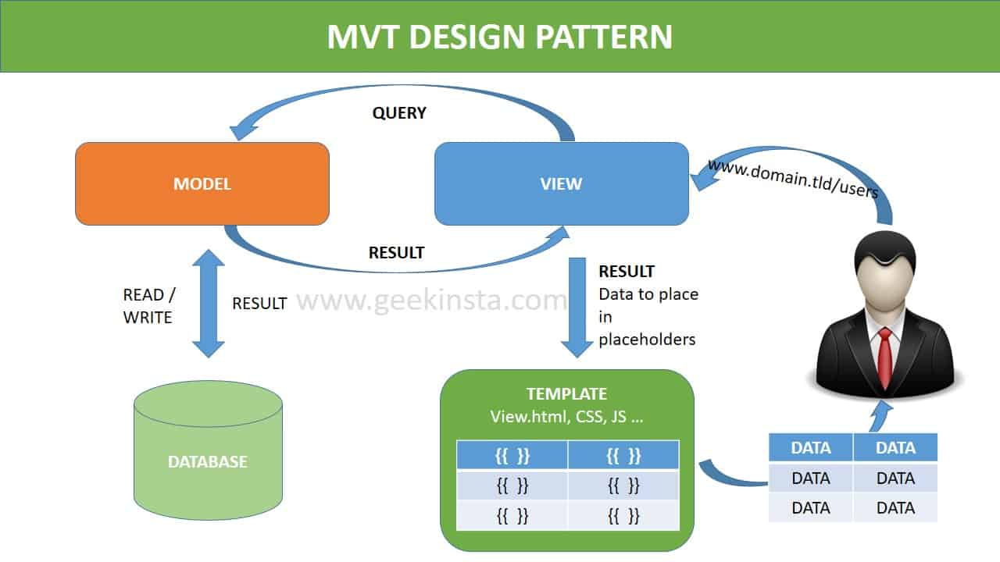
### 05.C. Web services (deux grandes familles) :

|Acronym|Meaning|
|-------|-------|
|SOAP|Simple Object Access Protocol|
|XML|eXtensible Markup Language|
|REST|REpresentational State Transfer|
|JSON|JavaScript Object Notation|
### 05.D. Communication client/serveur 
### 05.D.a. La méthode AJAX (Asynchronous JavaScript And XML)
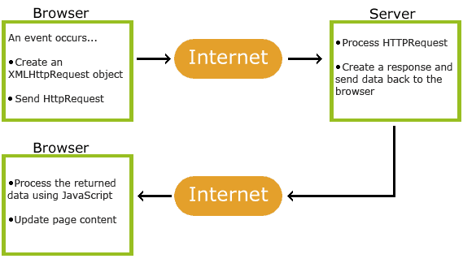
### 05.D.b. Les protocoles internet :
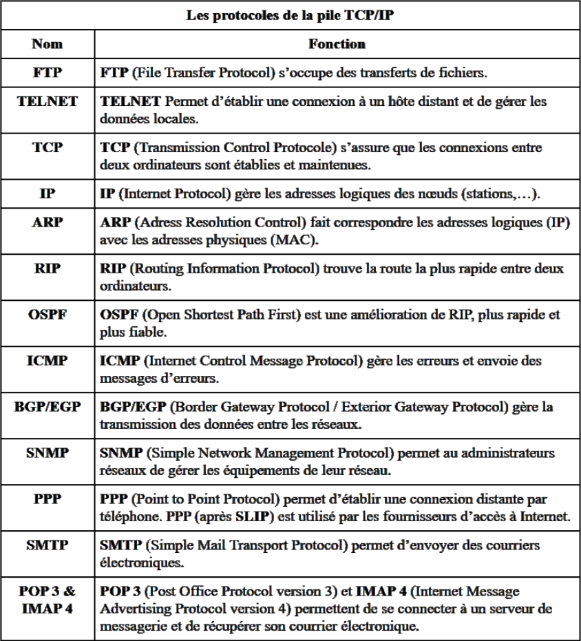
### 05.D.c. HTTP request

### 05.D.d. HTTP methods

### 05.D.e. HTTP status code

### 05.D.f. HTTPS
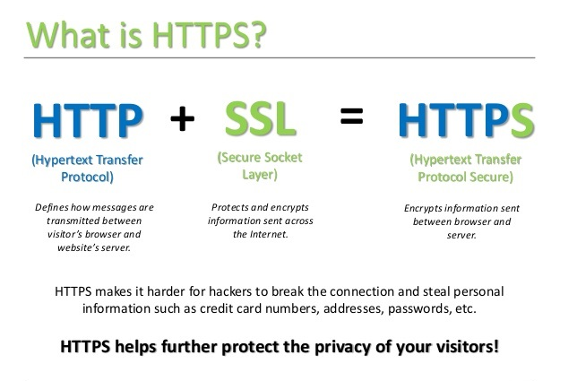
### 05.D.g. HTTP/1 vs HTTP/2

### 05.D.h. Le modèle OSI et le modèle TCP/IP

### 05.D.i.  Duplex (canal de communication)

#### 05.D.i. - Les Websockets sont une spécification full-duplex du protocole HTTP.
##### 05.D.i. • Utilisé pour le développement de messagerie instantanée.

# XII - Base de données 
## 01. RDBMS / SGBDR :

### 01.A. Propriétaire : 
|Popularity|Name|
|----------|----|
|#1|Oracle|
|#2|Micrsoft Server|
|#3|MySQL|
### 01.B. Libre : 
|Popularity|Name|
|----------|----|
|#1|PostegreSQL|
|#2|MariaDB|
|#3|SQLite|
## 02. OLTP (Online Transactional Processing) / OLAP (Online analytical processing)
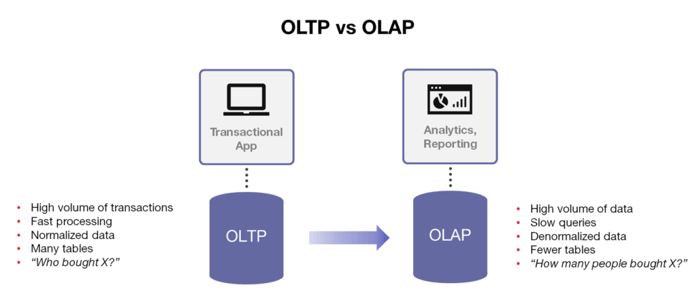
## 03. SQL

### 03.A. Les jointures

## 04. NoSQL databases :

## 05. Cloud providers :

## 06. ORM (Object-Relational Mapping)

# XIII - La mémoire : 
## 01. Allocation statique vs dynamique

## 02. Stockage de la mémoire
### 02.A. Queue allocation (la file)

### 02.B. Stack allocation (la pile)
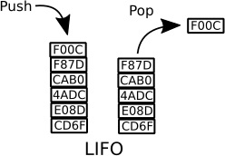
### 02.C. Heap allocation (le tas)

## 03. Les pointeurs

# XIV - File management (read, write, append, create, etc.)
## 01. Les types de fichiers (TXT, CSV, JSON, PDF, etc.)

# XV - Les algorithmes (voir : project euler)
## 01. Performances
### 01.A. Time complexity : mesure de la complexité d'un calcul en fonction de son nombre d'étapes, autrement dit son temps d'exécution.
### 01.B. Big O notation : il s'agit d'une notation décrivant la complexité d'un temps de calcul.
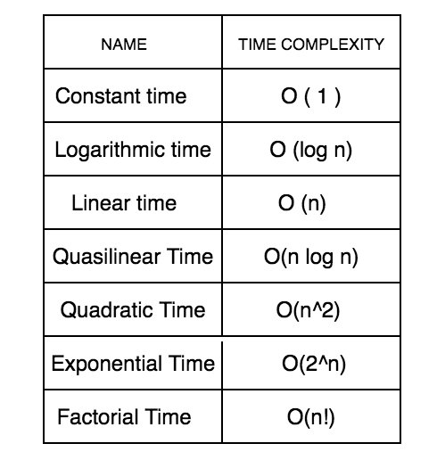
## 02. Les algorithmes pricipaux
### 02.A. Sort Algorithms (Merge Sort, Quick Sort, Bucket Sort, Heap Sort, Counting Sort)
### 02.B. Search Algorithms (Binary search, Depth/Breadth First Search)
### 02.C. Hashing
### 02.D. Dynamic Programming
### 02.E. Exponentiation by squaring
### 02.F. String Matching and Parsing (KMP Algorithm, Regular Expression)
### 02.G. Primality Testing Algorithms

# XVI - Testing
## 01. Pyramid : 

## 02. Autres :
### 02.A. Test fonctionnels et non fonctionnels
### 02.B. Smoke test and sanity check
### 02.C. Proof of Concept (PoC)
## 03. Exception Handling :
### 03.A. try… raise/catch/except…finally/except
### 03.B. throws…throw

# XVII - Les designs patterns (outil apporte des solutions aux problèmes communs de développement logiciel en rendant le code flexible, réutilisable et maintenable)
## 01. Il existe 3 grand type de design pattern
### 01.A. Creational « factory » : création
### 01.B. Behavioral: comportemental
### 01.C. Structural : structurante

# XVIII - Documentation logicielle
## 01. L'expression de besoin 
### 01.A. Définit le besoin du métier lors d'une demande.
## 02. Architecture / Conception : diagrammes UML)
### 02.A. Vue d'ensemble sur le logiciel. Elle inclut les relations à l'environnement et les principes à utiliser dans la conception et la réalisation des composants logiciels.
## 03. Technique
### 03.A. Documentation du code, algorithmes, interfaces, et interfaces de programmation (API).
## 04. Utilisateur
### 04.A. Manuels pour les utilisateurs, administrateurs systèmes et personnel de support.
## 05. Marketing
### 05.A. Instructions sur le produit et garantie promotionnelle.

# XIX - L’architecture des ordinateurs (Taxonomie de Flynn)
## 01. Single Instruction on Single Data

## 02. Multiple Instructions on Single Data
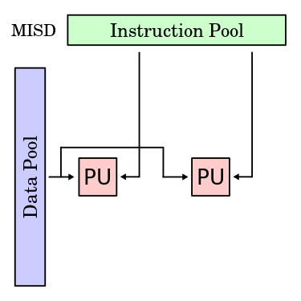
## 03. Single Instruction on Multiple Data

## 04. Multiple Instructions on Multiple Data 

# XX - Single-Thread vs Multi-Thread programming

# XXI - Synchronous vs Asynchronous programming 

# XXII - Sequential vs Concurrent vs Parallel programming
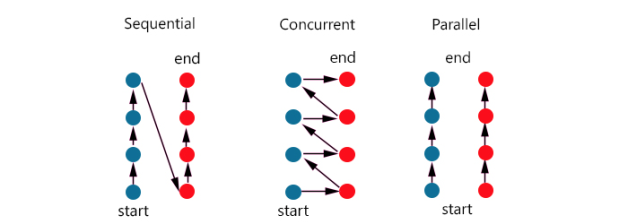

# XXIII - DevOps
## 01. Git & Git CLI (#1 GitHub, #2 Gitlab, #3 Bitbucket, #4 Gitbucket)

## 02.  Semantic versioning

## 03. Linux

|Distribution|
|------------|
|Debian|
|Ubuntu|
|CentOS|
|Redhat|
|Arch Linux|
|Fedora|

### 03.C. Les scripts bash

## 04. Protocole SSH (Secure SHell)

## 05. Les containers

## 06. CI / CD : Continuous Integrations / Countinuous Deployment
## 07. Les tests automatisé : Selenium
## 08. Logiciels de virtualisation : VirtualBox, VMWare
## 09. Autres outils devops :
### 09.A. Ansible
### 09.B. Jenkins
### 09.C. Vagrant : environnements de développement virtuel
### 09.D.Splunk

# XXIV. Data Science

## 01. Types de données :
<table>
  <tr>
    <td colspan="4">Données quantitatives (numérique)</td>
    <td colspan="4">Données qualitative (catégorielles)</td>
  </tr>
  <tr>
    <td colspan="2">Données de ratio</td>
    <td colspan="2">Données d'intervalles</td>
    <td colspan="2">Données ordinales</td>
    <td colspan="2">Données nominales</td>
  </tr>
    <td colspan="1">Données discrètes : Zéro identifiable. Peut prendre une seule valeur entière</td>
    <td colspan="1"> Données continues : Zéro identifiable. Peut prendre une infinité de valeur</td>
    <td colspan="1">Données discrètes : Zéro arbitraire. Peut prendre une seule valeur entière</td>
    <td colspan="1"> Données continues : Zéro arbitraire. Peut prendre une infinité de valeur</td>
    <td colspan="2">Peut être classé</td>
    <td colspan="2">Ne peut être mesuré ou comparé</td>
  <tr>
  </tr>
</table>
 
## 02. Mathématiques
### 02.A. Linear algebra (algèbre linéaire)
#### 02.A.a. Matrix (matrice)
## 03. Statistiques
### 03.A. Mean (moyenne) : Résume une série de valeur en un seul nombre réel. Il s'agit de la somme des valeurs d'une série divisé par son nombre d'élément.
### 03.B. Median (Médiane) : Permet de partager une série de valeur en deux parties de même nombre d'élément. Il s'agit de la valeur du milieu d'une sérieu rangé par ordre croissant.
### 03.C. Mode (mode) : Permet de connaître la (ou les) valeur(s) la (ou les) plus fréquante(s) dans une série. Il s'agit d'une valeur ayant le plus de récurrence dans une série.
### 03.D. Variance (variance) : Mesure de la dispertion des valeurs d'unéchantillon ou d'une distribution de probabilité (sans tenir compte des signes).
### 03.E. Standard deviation (écart-type) :  Mesure de la dispertion des valeurs à partir de la moyenne.
### 03.F. Confidence Interval (Intervalle de confiance) : Défini une marge d'erreur dans un résultat. Le dégré de confiance est souvent défini à 95%, ce qui signifi qu'en moyenne, 95% des résultats seront correct.
### 03.G. Expected value (espérance) : Représente la valeur que l'on s'attend à trouver, en moyenne, si 'lon répète un grand nombre de fois la même expérience aléatoire. Il s'agit d'une moyenne pondérée par les probabilités d'apparition de chaque valeur.
### 03.H. Percentile (percentile) : Décrit la valeur à laquelle un pourcentage donné des valeurs est inférieur.
### 03.I. Quantiles : divisent un jeu de données en intervalles contenant le même nombre de données.
### 03.J. RMSE (ROOT MEAN SQUARE ERROR)
### 03.K. R-squared : mesure la qualité de la prédiction d'une régression linéaire, ainsi la qualité du model utilisé.
### 03.L. L'échatillonnage : On essaye de représenter une population à partir d'un sous ensemble. Les types d'échantillons sont : aléatoire, arbitraire, par itinéraire et par quotas.
### 03.M. p-value : est la probabilité pour un modèle statistique donné sous l'hypothèse nulle d'obtenir la même valeur ou une valeur encore plus extrême que celle observée.
## 04. Probabilité
### 04.A. Normal distribution / Gaussiandistribution (loi normal ou loi de Gauss) : La loi normale (ou loi de Gauss) permet de modéliser des phénomènes naturels issus de plusieurs évènements aléatoires.
### 04.B. Continuous uniform distribution / rectangular distribution (loi uniforme continue ou loi rectangulaire) : La loi uniforme continue (ou loi rectangulaire) a pour propriétéque la densité de probabilités deceslois est constante sur leur support.
### 04.C. Discrete uniform distribution (loi uniforme discrète) : La loi uniforme discrète est uneloi indiquantune probabilité de se réaliser identiqueà chaque valeur d'un ensemble fini de valeurs possibles.
### 04.D. Binomial distribution (loi binomiale) : La loi binomiale modélise la fréquence du nombre de succès obtenus lors de la répétition de plusieurs expériences aléatoires identiques et indépendantes.
### 04.E. Poisson distribution (loi de poisson) : La loi de poisson est une loi qui décrit le comportement du nombre d'évènement se produisant dans un intervalle de temps fixé.
## 05. Big Data
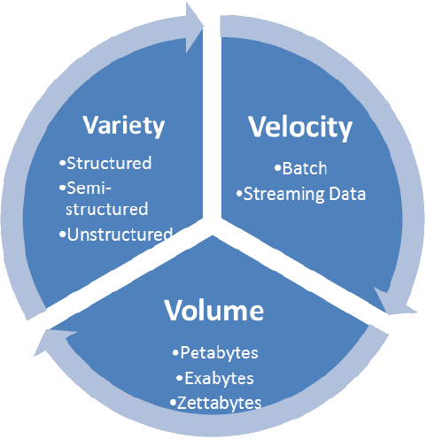
## 06. Intelligence artificielle

### 06.A. Les réseaux neuronaux
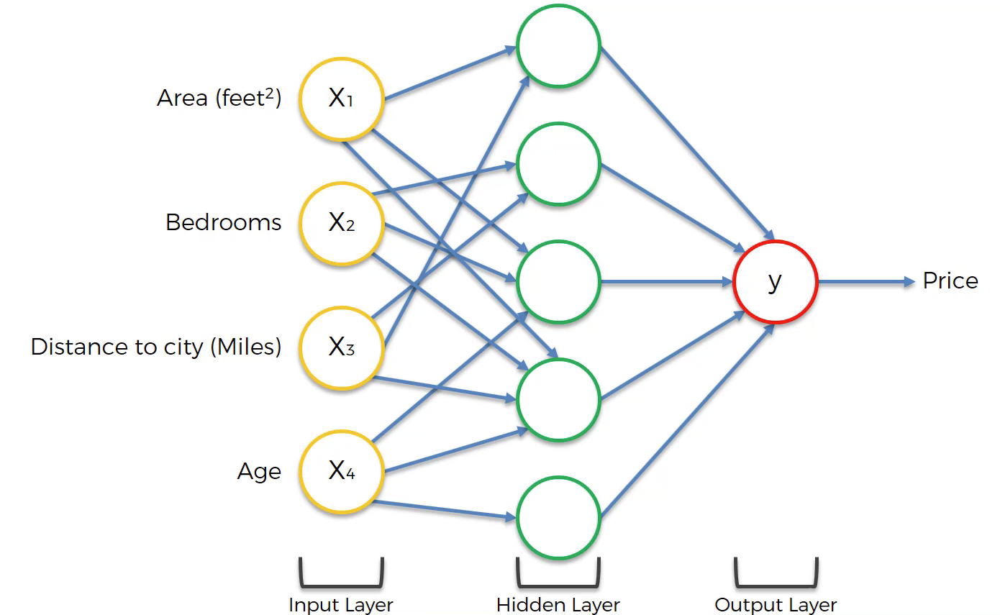
#### 06.A.a. Weight : importance de l'influence de l'input sur l'output
#### 06.A.b. Biais : constante d'ajustement
#### 06.A.c. Softmax activation
## 07. La blockchain
### Une blockchain est un registre, une grande base de données qui a la particularité d’être partagée simultanément avec tous ses utilisateurs, tous également détenteurs de ce registre, et qui ont également tous la capacité d’y inscrire des données, selon des règles spécifiques fixées par un protocole informatique très bien sécurisé grâce à la cryptographie.
|Proof of Work (POW)|Proof of Stake (POS)|
|-------------------|--------------------|

## 08. Time series
## 09. Machine learning :

### 09.A. Augmenter la précision du modèle :
#### 09.A.a. Ajouter des données
#### 09.A.b. Traiter les valeurs manquantes ou aberrantes
#### 09.A.c. Transformer et créer des variables
#### 09.A.d. S'appuyez sur les connaissances du domaine, la viz, la p-value ou le PCA (principal component analysis)
#### 09.A.e. Utiliser un autre algorithme (trouver le meilleur)
#### 09.A.f. Trouver les paramètres idéaux
#### 09.A.g. Combiner les résultats de différents modèle : bagging & boosting
#### 09.A.h. Le Surentrainement rend une modèle inprécis
#### 09.A.i. La cross-validation : laisser un échantillion sans entrainement pour le tester plus tard après l'entrainement
### 09.B. Classification VS Régression
### 09.C. Apprentissage : supervisé, non/semi-supervisé, par renforcement et incrémental

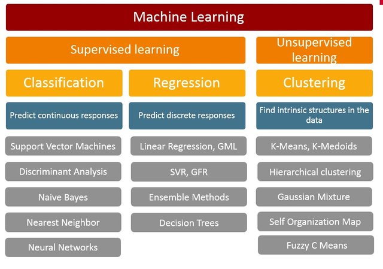
### 09.D. Algorithmes (k-moyennes / proches voisins, etc.)
## 10. Python libraries
|Domain|Librairies|
|------|---------|
|Machine Learning|scikit-learn, keras, orange|
|Web Scraping|beautifulsoup, selenium, scrapy|
|Deep Learning|tensorflow, pytorch|
|Data Visualization|matplotlib, seaborn|
|Data Analysis|pandas, numpy, scipy|
|Image Processing|pillow, opencv|
|Audio processing|Librosa|
|Natural Language processing|NLP, NLTK|
|Statistics|statsmodels|
## 11. JavaScript libraries
|Domain|Librairies|
|------|---------|
|Data Visualization|D3, DC, processing|
|Machine Learning|ml|
|Web Scraping|puppeteer|
## 12. R packages
|Domain|Packages|
|------|---------|
|Data Visualization|ggplot2, plotly, esquisse|
|Machine Learning|mlr3|
|Data analysis|dplyr|
|Web Scraping|RCrawler|
|Mics|Tedyverse, bioconductor, shiny|
## 13. Hadoop
## 14. Apache Spark
## 15. Tools : Tableau, PowerBI, Qlickview, Excel, etc.

# XXV - Mobile development
## 01. Android
### 01.A. Plateforme : Android Studio
### 01.B. Langage : Java, Kotlin
## 02. iOS
### 02.A. Plateforme: Xcode
### 02.B. Language : Swift, ~~Objective-C~~
## 03. Cross-plateform
### 03.A. Flutter & Dart
### 03.B. JavaScript & React Native
### 03.C. Xamarin & C#
### 03.D. HTML5 & Apache Cordova

# XXVI - Core EIMS (Enterprise Information Management Systems) Software
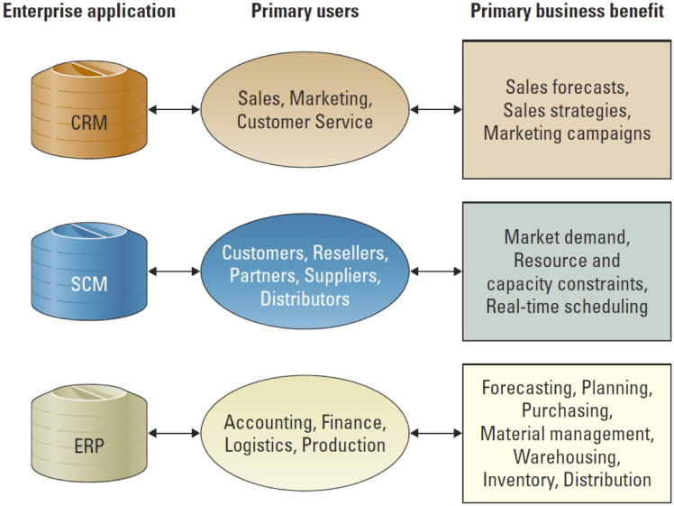

# XXVII - Législation
## 01. Propriété intellectuel et droit internet
## 02. Le RGPD (Règlement Général sur la Protection des Données) ou GDPR (General Data Protection Regulation
## 03. Hadopi (Haute Autorité pour la Diffusion des Œuvres et la Protection des droits sur Internet)
## 04. La CNIL (Commission Nationale de l'Informatique et des Libertés)
## 05. Les licences logiciels
### 05.A. Les quatre libertés fondamentales du logiciel libre :
#### 05.A.a. La liberté d'utiliser le logiciel ;
#### 05.A.b. La liberté d'étudier le logiciel ;
#### 05.A.c. La liberté de copier le logiciel ;
#### 05.A.d. La liberté de modifier le logiciel et de redistribuer les versions modifiées.

### 05.B. Logiciel propriétaire : 
#### 05.B.a. Par opposition au logiciel libre, un logiciel propriétaire ne garantit pas l'ensemble des quatre libertés du logiciel libre.

### 05.C Open-source : 
#### 05.C.a. Libre redistribution, d'accès au code source et de création de travaux dérivés
#### 05.C.b. Le code source est mis à la disposition du grand public, ce code source est généralement le résultat d'une collaboration entre programmeurs. 

### 05.D. Free Software Foundation :
#### 05.D.a. Organisation à but non lucratif dont la mission est la promotion du logiciel libre et la défense des utilisateurs.

### 05.E. Licence de logiciel permissive : 
#### 05.E.a. Licence publique générale GNU (GNU General Public License)
#### 05.E.b. Licence MIT : Licence de logiciel pour logiciels libres et open source, provenant de l'Institut de technologie du Massachusetts (MIT).
#### 05.E.c. Licence Apache : Licence de logiciel libre et open source. Elle est écrite par l'Apache Software Foundation. 
#### 05.E.d. Licence BSD (Berkeley Software Distribution License) : Elle permet de réutiliser tout ou une partie du logiciel sans restriction, qu'il soit intégré dans un logiciel libre ou propriétaire.

# XXVIII - Sécurité informatique / technique de piratage
## 01. Surface web vs Deep web vs Dark web
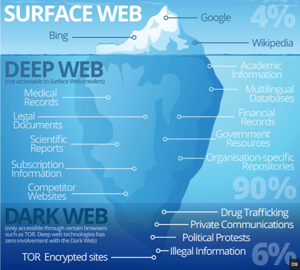
### 01.A. Tails
### 01.B. Tor
### 01.C. onion sites
## 02. VPN (Virtual Private Network) :
## 03. Firewall (pare-feu) :
## 04. Windows defender :
## 05. Antivirus :
## 06. Pen test :
### 06.A. Kali linux
### 06.B. Metasploit
## 07. Le chiffrement (ou cryptage) vs le encrypter (ou encryption) :
## 08. Crypter / Cryptage vs Encrypter / Déencrypter :
## 09. Chiffrer / Déchiffrer :
## 10. Les algorithmes de hashage :
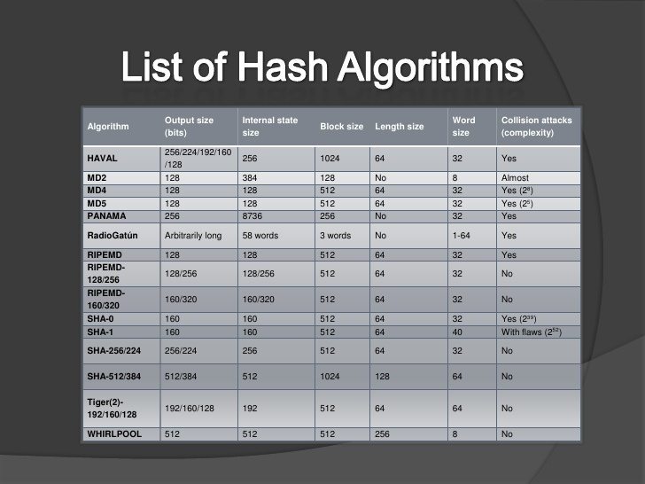
## 11. Permutations and combination formulae

## 12. Password cracking techniques :
|Nom|Définition|
|---|----------|
|Bruteforce attack|Cherche à cracker un mot de passe, en testant toutes les combinaisons possible.
|Dictionary attack|Cherche à cracker un mot de passe à  partir d'un dictionnaire, souvent grâce à un répertoire de mot de passe fréquemment utilisé dans le monde, généralement conçu à partir de fuites de données. 
|Hybrid attack|Attaque combinant l'attaque de la brute à celle de l'attaque par dictionnaire
|Rainbow table attack|Consite à trouver un mot de passe à partir de son empreinte numérique (issue d'une fonction de hashage|
|Phishing|Imitation d'un site internet de confiance de manière à trompé sa victime, ainsi il pensera être en lieu sûr et pourrait saisir ses identifiants qui seront transmit à l'attaquant.
## 13. Les logiciels malveillants ou malwares : Les chevaux de Troie, les ransomwares, etc.
## 14. Les sniffer (analyseur réseau) : Permet d'écouter le trafic d'un réseau afin de capturer les informations qui y circulent.
## 15. Injection SQL : Résultant d'une faille de conception, l'attaque permet d'envoyer des requêtes dans un système afin de le saboter et/ou de dérober des informations.
## 16. MITM (Man in the middle attack) ou HDM (Attaque de l'homme du milieu) : L'objectif de cette attaque est d'intercepter les communications entre deux hôtes.
## 17. Backdoor (Porte dérobée) :
## 18. DDoS attack (Distributed Denial-of-Service attack) : Attaque ayant pour objectif de rendre impossible l'accès à un service. Par exemple en envoyant un nombre de requêtes tel que le réseau est inondé, le rendant hors d'usage.
## 19. Le drive-by download ou téléchargement furtif : Cette attaque infecte les ordinateurs des personnes présentant des failles de sécurités, à partir d'un virus présent sur une page d’un site internet non sécurisé.

# XXIX - Management
## 01. Méthodologie
### 01.A. Agile
#### 01.A.a. Le manifeste agile
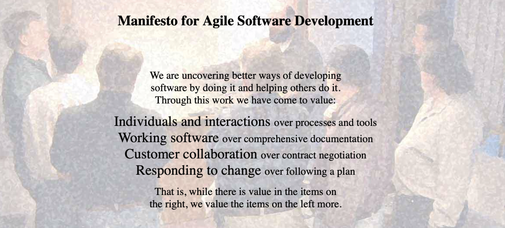
#### 01.A.b. Les principes du manifeste agile
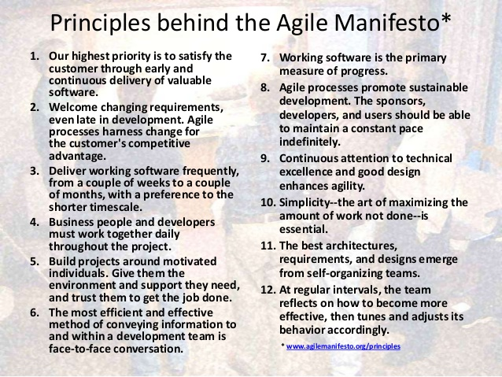
#### 01.A.c. Les frameworks agile - cf : stateofagile.com 14th annual report (2020)
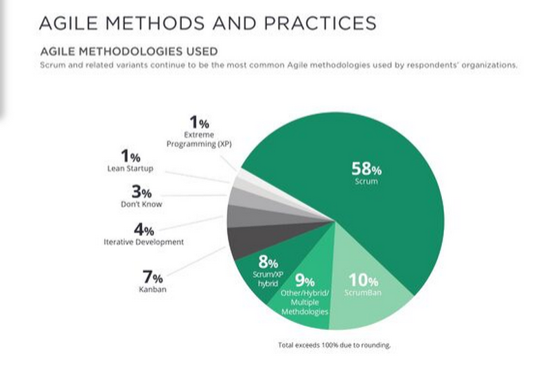
### 01.B. ITIL
### 01.C. Lean management vs Six Sigma management vs Lean Six Sigma management
|Management method|Principe|
|-----------------|--------|
|Lean|Focus on eliminating waste|
|Six Sigma|Focus on eliminating variation|
|Lean Six Sigma|Combinaison of both|
## 02. Techniques
|Name|
|----|
|WBS (Work Breakdown Structure)|
|PERT (Program Evaluation and Review Technique)|
|CPM (Critical Path Method)|
|Gantt chart|
## 03. Lois de productivité :

## 04. La matrice d'Eisenhower :
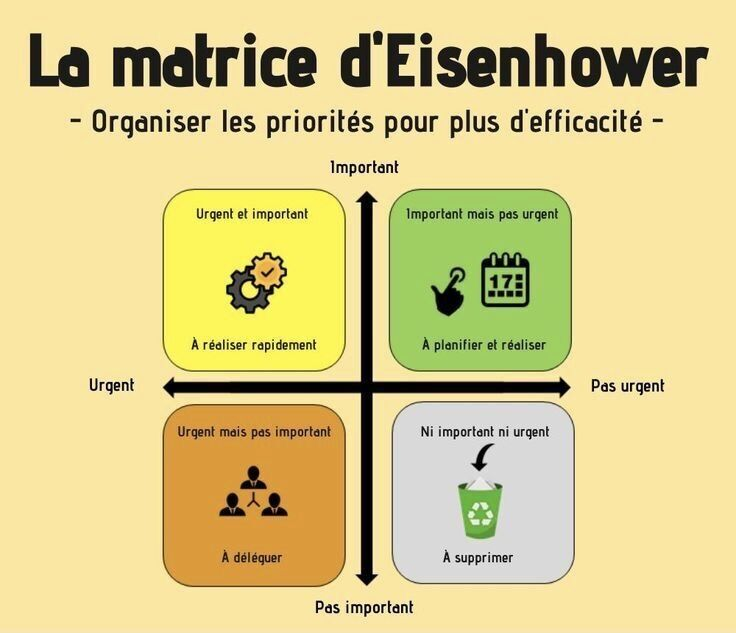

# XXX - Business operations
## 01. Strategic planning
|Step|Strategic Planning Process|
|----|--------------------------|
|1|Determine your strategic position.|
|2|Prioritize your objectives.|
|3|Develop a strategic plan.|
|4|Execute and manage your plan.|
|5|Review and revise the plan.|
## 02. Enterprise performance management (EPM)
### It describes methods and solutions that are required for enterprise management
|Management processes|
|--------------------|
|Budgeting, planning, forecasting|
|Modeling the value creation of a company|
|Consolidation of the results|
|Performance analysis|
## 03. Business intelligence and analytics (BA and BA)
|Comparison|Business Intelligence|Business Analytics|
|----------|---------------------|------------------|
|Definition|Analyses past and present to drive current business needs|Analyses past data to drive current business.|
|Usage|To run current business operations|To change business operations and improve productivity.|
|Ease of Operations|For current business operations|For future business operations.|
|Tools|SAP Business Objects, QlikSense, TIBCO, PowerBI etc.,|Word processing, Google docs, MS Visio, MS Office Tools etc.|
|Applications|Apply to all large-scale companies to run current business operations|Applies to companies where future growth and productivity as its goal.|
|Field|Comes under Business Analytics|Contains Data warehouse, information management etc.|
## 04. Key performance indicators (KPI)
### Measure your performance against key business objectives
## 05. Management reporting
### Reports that management uses to run the organization, make business decisions, and monitor progress. 
|Objectives|
|----------|
|Measure and monitor specific performance metrics and KPIs.|
|Understand your status, health and what you should do next.|
|Determine benchmarks.|
|Ensure better communication between stakeholders, colleagues, and executives.|
|Guide your next steps.|
|Force you to have an action plan.|
|Monitor performance frequently.|
## 06. Strategic decision making
### Strategic decision-making is the process of charting a course based on long-term goals and a long-term vision. By clarifying the company's overall objectives, the ability to align short-term plans with this deeper and broader mission, giving operations clarity and consistency.

# XXXI - Game development
## Game engine
|Game engine|Language|
|-----------|--------|
|Unreal Engine|C++|
|Unity|C#|

# XXXII - Low-code vs No-code
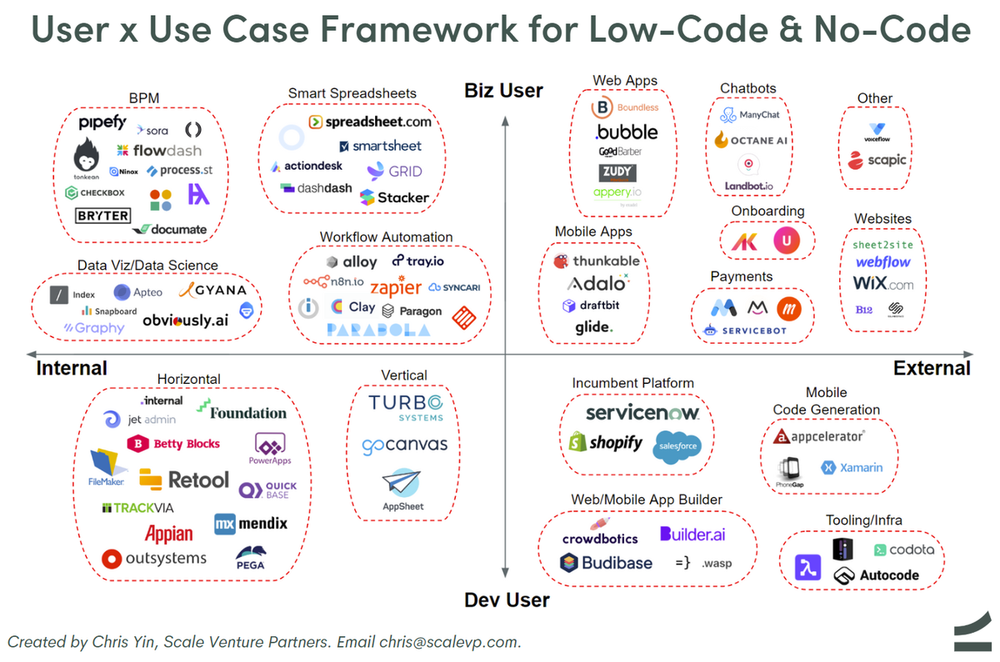
